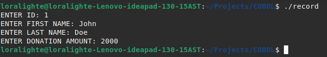
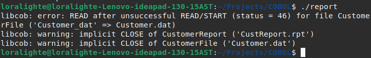

# COBOL-DONOR-REPORTMAKER
A simple COBOL program to track donations and create a report based on said donations. It's a buggy program, and my second ever in COBOL.

## How to run
* Install `GnuCOBOL`
* ```sh
  cobc -x record.cob # For recording data
  cobc -x report.cob # For creating data
  ```
* Run the binaries to hearts content!

### Examples
Record:


Report (Ignore errors `:)` ):
